##
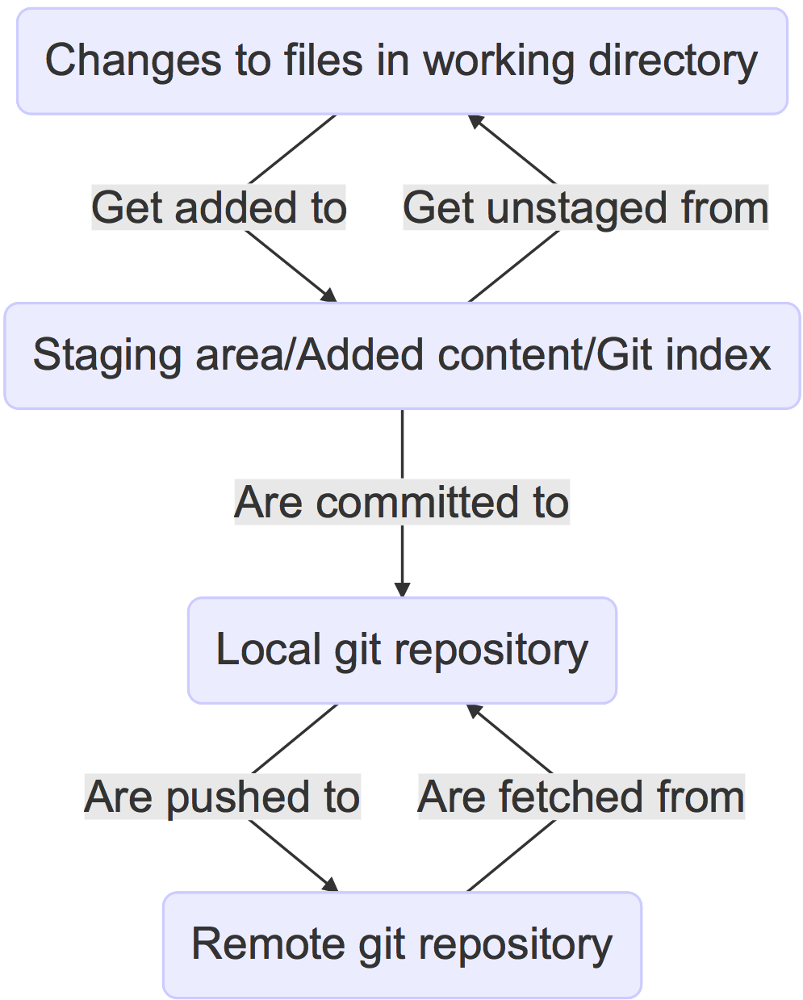
## 上下游
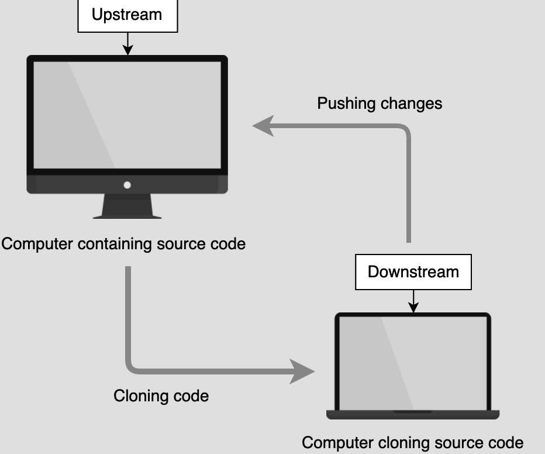
## 版本控制系统对比
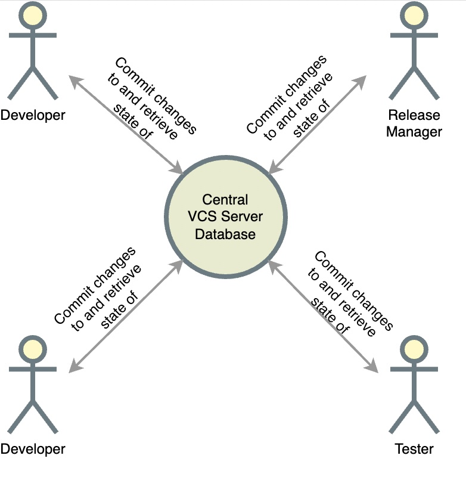
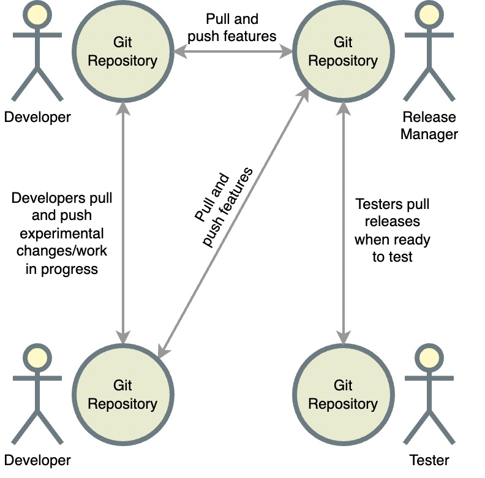

## branch

* A branch is a pointer to the end of a line of changes.
* A tag is a pointer to a single change.
* HEAD is where your Git repository is right now.
* Detached HEAD means you are at a commit that has no reference (branch or tag) associated with it.

```
// 删除远程分支
git push origin :远程分支名
```

## merge
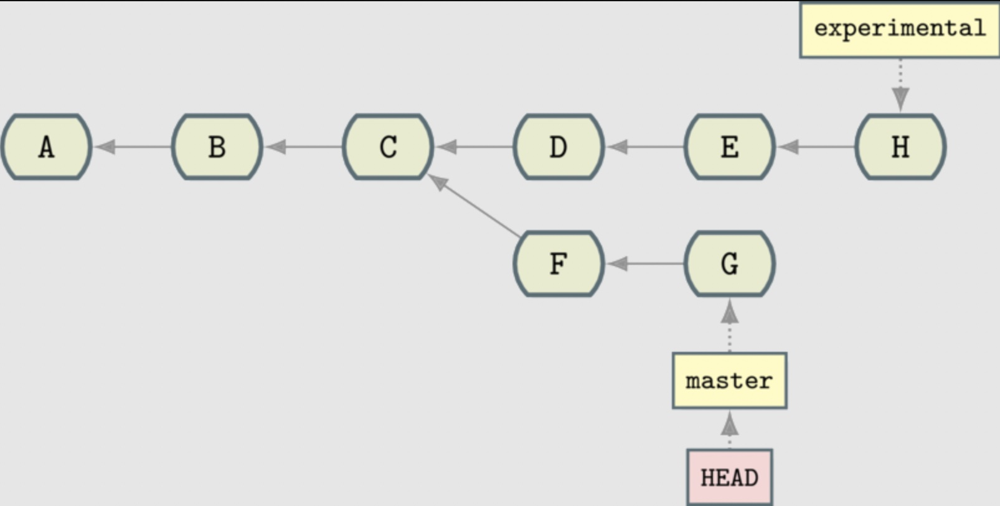

git merge experimental

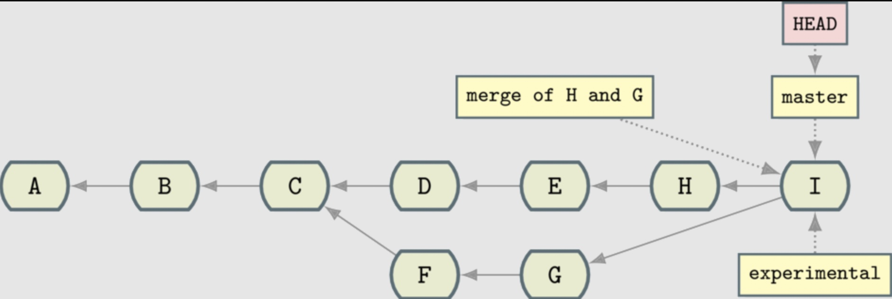

### 缺点
1. history 变得更复杂了。
2. 引入了一个新的提交用来 merge 两个分支

## rebase

Take a set of changes from a particular point and apply them from a different point

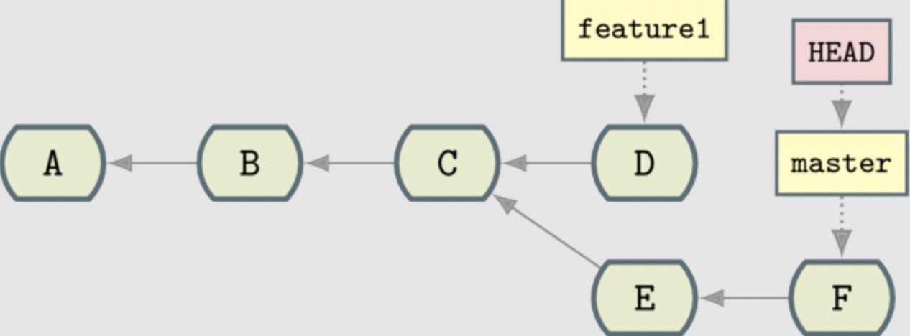
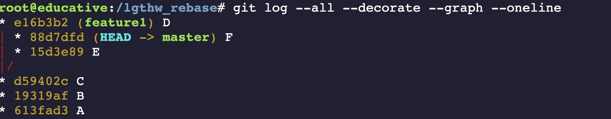
```
git checkout feature1
git rebase master
```
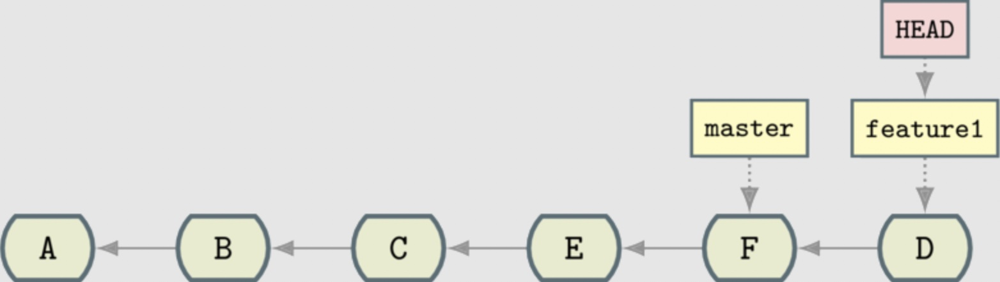
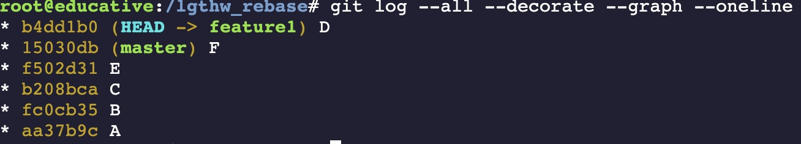

```
git checkout master
git merge feature1
git log --all --decorate --graph --oneline
```
Because the changes are in a line, there aren’t any new changes that need to be made. The master branch pointer merely needs to be “fast-forwarded” to the same point as feature1!

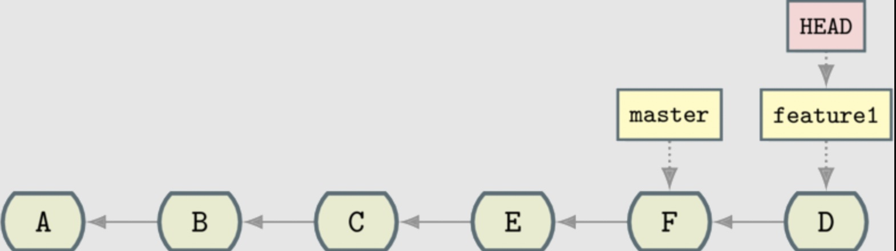
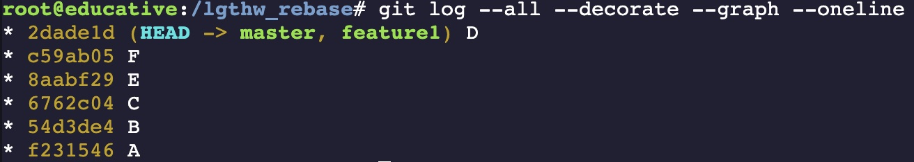

## bisection
二分法
## ~ vs ^
[参考](https://stackoverflow.com/questions/2221658/whats-the-difference-between-head-and-head-in-git)

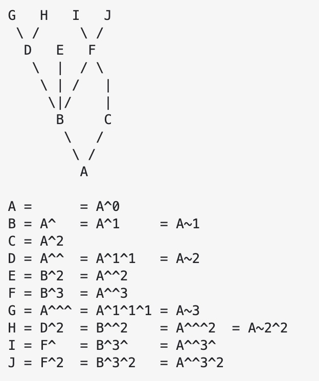
Both commit nodes B and C are parents of commit node A

## submodules
```
mkdir -p lgthw_submodules/alicelib && cd lgthw_submodules/alicelib
git init
echo 'A' > file1
git add file1
git commit -am 'A'
git checkout -b experimental      # Branch to experimental
echo 'C - EXPERIMENTAL' >> file1
git commit -am EXPERIMENTAL
git checkout master
echo 'B' >> file1
git commit -am 'B'
```

```
cd .. && mkdir bob_repo && cd bob_repo
git init
echo 'source alicelib' > file1
git add file1
git commit -am 'sourcing alicelib'
echo 'do something with alicelib 9  experimental' >> file1
git commit -am 'using alicelib experimental'
cat file1
```

```
git submodule init
git submodule add ../alicelib

//.gitmodules file tracks where the submodule comes from
ls -a

git submodule status
```

```
cd alicelib
git branch -a -vv
git checkout experimental
git branch -a -vv
// track a completely different branch if you specify it
git checkout -b alicemaster --track origin/master
```

```
cd ../
git diff
git commit -am 'alicelib moved to experimental'
```

```
cd ../alicelib
git checkout experimental
echo 'D' >> file1
git commit -am 'D - a fix added'

cd ../bob_repo/alicelib
git status
```
## Cloning a Project With Submodules
```
cd ../..
git clone bob_repo bob_repo_cloned

//前面的破折号（或减号）表示子模块未检出。 只有通过运行 git submodule init 和 git submodule update 才能检索适当的子模块存储库：
git submodule status

git submodule init
git submodule update
git submodule status
```

```
git clone --recursive
```

## git log
```
git log --graph --oneline --all --decorate --simplify-by-decoration
// relative timestamp (%ar), 
// the commit subject (%s), 
// and the short hash (%h)
git log --graph --oneline --all --decorate --simplify-by-decoration --pretty='%ar %s %h'
```

## patch 
```
git diff-tree -p abranchtag > abranchtag.patch

cat abranchtag.patch | git apply

cat abranchtag.patch | git apply --reject

--- from-file from-file-modification-time
+++ to-file to-file-modification-time
@@ from-file-line-numbers to-file-line-numbers @@
 line-from-either-file
 line-from-either-file…
```

## cat >> EOF
https://stackoverflow.com/questions/2500436/how-does-cat-eof-work-in-bash

[基本正则表达式](https://www.arubanetworks.com/techdocs/ArubaOS_63_Web_Help/Content/ArubaFrameStyles/ESI/Basic_Regular_Expression.htm)

## bare repository
[git server](https://git-scm.com/book/en/v2/Git-on-the-Server-Getting-Git-on-a-Server)
