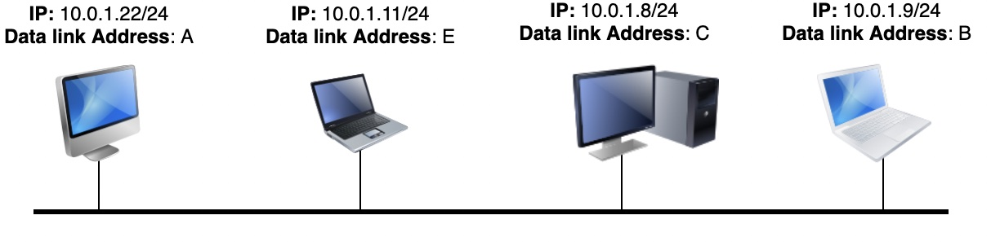

# 地址解析协议
[rfc826](https://datatracker.ietf.org/doc/html/rfc826)

## 目标
IPv4 主机和路由器必须能够自动获取与同一 LAN(Local area network) 上的任何 IPv4 地址对应的数据链路层地址。

ARP 是一种数据链路层协议，依赖于数据链路层服务向连接到同一 LAN 的所有设备广播帧的能力

## 实现

1. 假设主机 10.0.1.22/24 需要向主机 10.0.1.8 发送 IPv4 数据包。为此，发送主机必须找到附加到主机 10.0.1.8 的数据链路层地址。

2. 每个 IPv4 主机都维护一个 ARP 缓存，其中包含它知道的 IPv4 地址和数据链路层地址之间的所有映射。

    **大多数 ARP 实现会删除几分钟内未使用的缓存条目。**

    发送方 10.0.1.22 首先查询其 ARP 缓存。由于缓存中不包含请求的映射，发送方在局域网上发送广播 ARP 查询帧。

3. 该帧包含：发送方的数据链路层地址，在我们的例子中是 A，目标的 IPv4 地址，在示例中为 10.0.1.8。该广播帧被 LAN 上的所有设备接收。**每台主机在接收到 ARP 查询时都会将发送者的 IP 地址和数据链路层地址的条目插入到它们的 ARP 缓存中**。

4. LAN 网段上的每个主机都会收到 ARP 查询，但是只有拥有请求的 IPv4 地址的主机才会通过返回带有请求映射的**单播 ARP 回复帧**进行回复。

5. 收到此回复后，发送方更新其 ARP 缓存并使用数据链路层服务发送 IPv4 数据包。