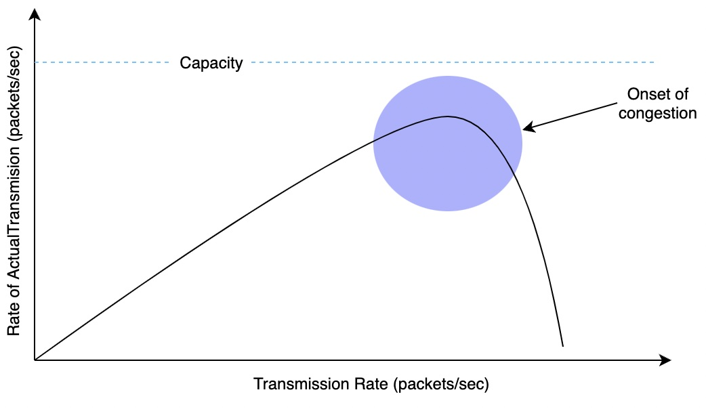
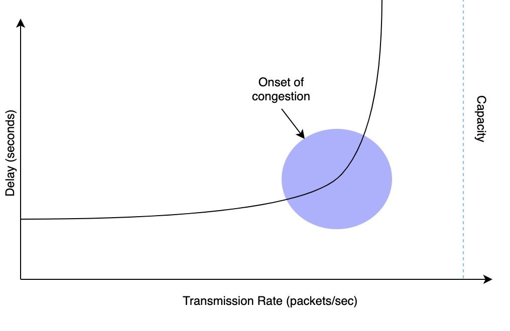

# 拥塞控制

## 什么是拥塞
当发送的数据包数量超过网络带宽时，其中一些数据包开始被丢弃，而其他数据包被延迟。 这种现象会导致整体性能下降，称为拥塞。

拥塞物理上发生在网络层（即在路由器中），但主要是由传输层一次发送过多数据引起的。 这意味着它也必须在传输层处理或“控制”。

## 带宽分配原则

1. 每个连接分配带宽
2. 流量是突发的，将带宽平均分配给每个主机可能会导致使用的带宽超过分配的带宽

## 瓶颈链路（具有最低带宽的链路）不能过载
在任何给定时间分配给所有主机的传输速率总和应近似等于瓶颈链路的带宽

## 拥塞崩溃
当所有终端系统发送大量流量但没有接收到任何流量时，就会发生拥塞崩溃，例如，当所有或大部分数据包被丢弃时。 造成这种情况的原因有几个，包括但不限于虚假重传。 当数据包未丢失但尚未到达目的地的重传计时器超时时，就会发生虚假重传。 因此，大部分网络带宽最终被少量数据包消耗。

## 最佳传输速率

$$Power = \frac{Transmission Rate}{Delay}$$
当 power 最大时，传输速率是最佳的
