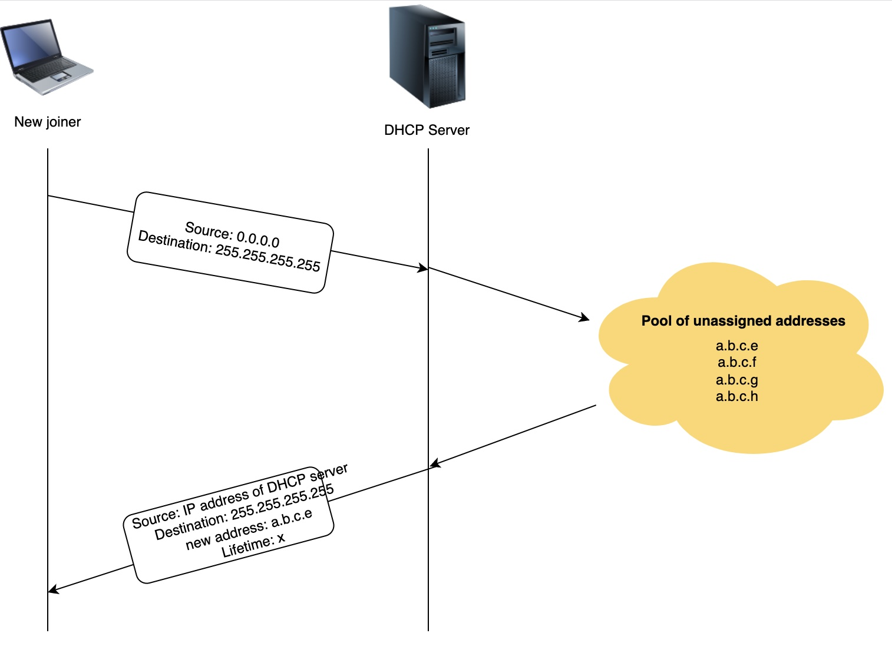
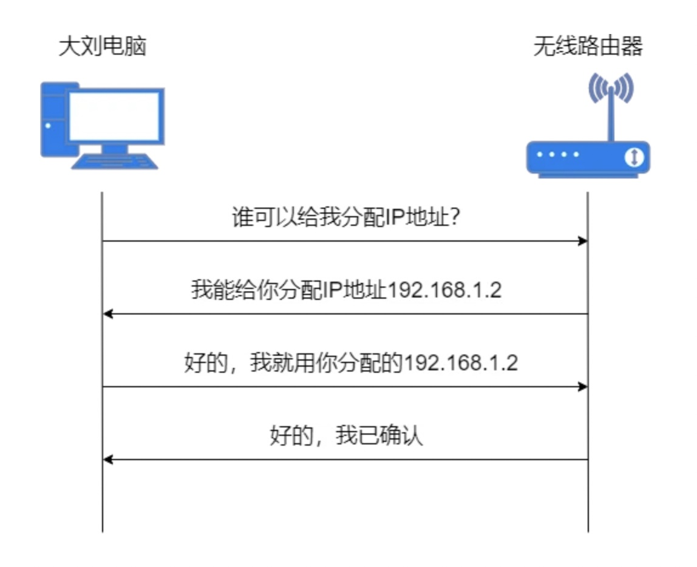
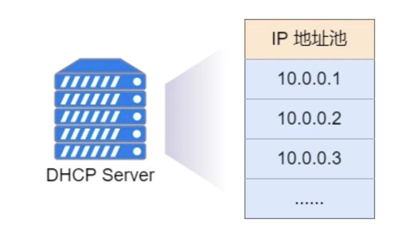
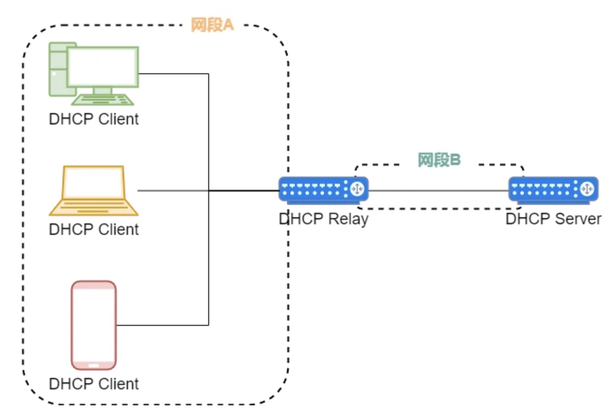
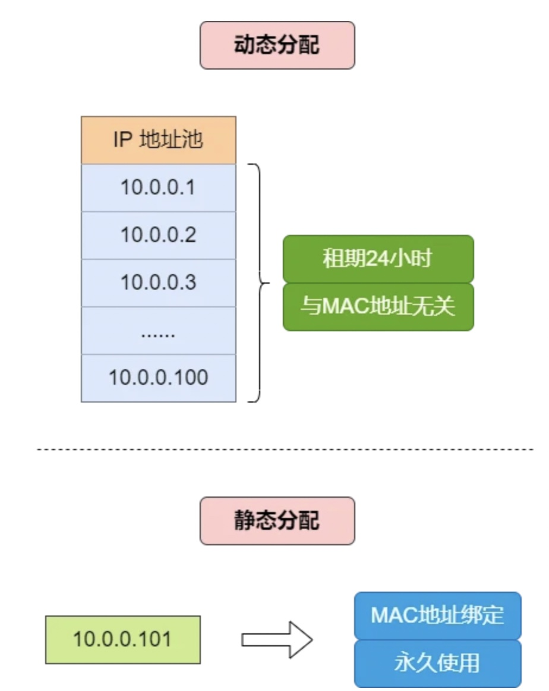
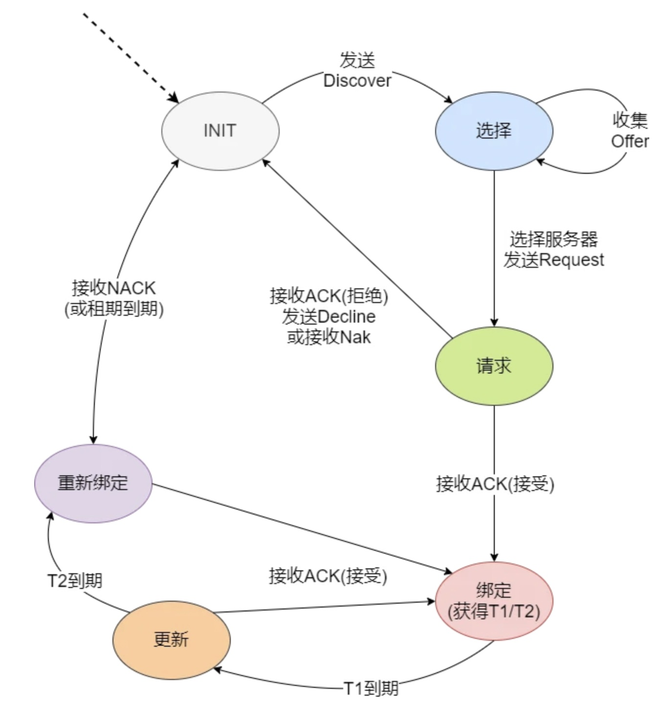
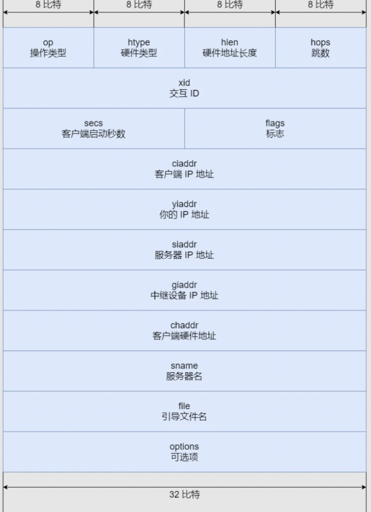

# DHCP
[rfc2131](https://datatracker.ietf.org/doc/html/rfc2131.html)

[参考链接](https://new.qq.com/omn/20210525/20210525A042J100.html)

DHCP 是一种Client/Server 模式的网络协议，使用 UDP 协议

DHCP Client 向 DHCP Server 提出配置申请

DHCP Server 返回为 DHCP Client 分配的配置信息。

这里的 Client 和 Server 是应用程序，可以运行在电脑、服务器、路由器等设备上。

## DHCP 服务器(端口号是67)
### DHCP 服务器分配策略
1. 动态分配机制

    通过 DHCP 为 Client 分配一个有使用期限的 IP 地址。如果 Client 没有及时续约，到达使用期限后，这个地址可能会被其它 Client 使用。绝大多数 Client 使用的都是这种动态分配的地址。
2. 静态分配机制

    通过 DHCP 为特定的 Client 分配固定的 IP 地址。固定 IP 地址可以永久使用， Client 通常是打印机、服务器等设备。

## DHCP 客户端(端口号是68)
### DHCP 状态机

### 报文作用
* DHCP Discover:DHCP Client 首次接入网络，DHCP 交互过程的第一个报文，用来寻找 DHCP Server的请求报文。

* DHCP Offer:DHCP Server 用来回应 DHCP Discover 报文的，并携带网络参数，包括：IP 地址、子网掩码、默认网关、DNS 服务器等。

* DHCP Request:DHCP Client 发送的报文，有三种使用场景：

    1. 根据策略选择相应的 DHCP Server，并回应 DHCP Offer 报文；

    2. DHCP Client 非首次接入网络，直接发送 DHCP Request 报文来申请之前使用过的 IP 地址等参数；

    3. 当 IP 地址的租约到期后，发送 DHCP Request 进行租期更新。

* DHCP Ack:DHCP Server 对 DHCP Request 报文的回应报文，进行最终确认。DHCP Client 收到这个报文后，才能获得 IP 地址和相应网络参数。

* DHCP Nak:DHCP Server 对 DHCP Request 报文的回应报文，当 DHCP Request 报文中的各个参数都正确时，回应DHCP Ack 报文，否则回应DHCP Nak 报文，告诉 DHCP Client 禁止使用获得的 IP 地址。

* DHCP Decline:当 DHCP Client 收到 DHCP Ack 报文后，还会发送免费 ARP报文，确认申请的 IP 地址是否已经在网络上使用了。如果 IP 地址已经被其它 Client 使用，那么 DHCP Client 发送 DHCP Decline 报文，拒绝分配的 IP 地址，并重新向 DHCP Server 申请地址。

* DHCP Release:当 DHCP Client 想要释放获得的 IP 地址时，向 DHCP Server 发送 DHCP Release 报文，DHCP Server 收到报文后，可将这个 IP 地址分配给其它的 Client 

* DHCP Inform:DHCP Client 通过手动方式获得 IP 地址后，还想向 DHCP Server获取更多网络参数时，比如：默认网关地址、DNS 服务器地址，DHCP Client 就向 DHCP Server 发送 DHCP Inform 报文进行申请。

## DHCP 中继

通常情况下，DHCP 采用广播方式实现报文交互，DHCP 服务仅限在本地网段使用。如果需要跨网段实现 DHCP ，那么使用DHCP Relay技术实现

## DHCP 报文

* op（操作类型）：表示报文的格式。当值为 1 时，表示客户端的请求报文；当值为 2 时，表示服务器的响应报文。

* htype（硬件类型）：不同的硬件类型取不同的值，最常见的以太网，值是 1 。

* hlen（硬件地址长度）：表示硬件地址长度，以太网的值是 6 ，也就是 MAC 地址的长度。

* hops（跳数）：DHCP 报文经过的 DHCP 中继的数量。

* xid（交互 ID ）：DHCP 客户端取的随机值，收到 DHCP 服务器的响应报文时，查看 xid 值是否相同，来判断报文是否是发送给自己的。

* secs（客户端启动秒数）：记录 IP 地址的使用时间。

* flags（标志）：广播响应标志位，当值为 0 时，表示服务器以单播形式发送响应报文；当值为 1 时，服务器以广播形式发送响应报文。

* ciaddr（客户端 IP 地址）：客户端的 IP 地址，可以是分配的地址，也可以是正在使用的地址，还可以是的 0.0.0.0 。0.0.0.0 是客户端初始状态没有地址的时候，仅用于临时通信，不是有效的地址。

* yiaddr（你的 IP 地址）：当服务器发送响应报文时，将分配给客户端的 IP 地址填入这个字段。

* siaddr（服务器 IP 地址）：用来标识服务器的 IP 地址。

* giaddr（中继设备 IP 地址）：表示 DHCP 中继的 IP 地址，服务器通过识别这个字段来判断出客户端的网段地址，从而选择合适的地址池，为客户端分配该网段的 IP 地址。

* chaddr（客户端硬件地址）：用来标识客户端的硬件地址，当客户端发送广播发现报文时，这个字段就是自己的硬件地址。

* sname（服务器名）：可选项，DHCP 服务器填写这个字段。

* file（引导文件名）：可选项，DHCP 服务器填写这个字段。

* options（可选项）：可选项，DHCP 客户端获取网络参数，DHCP 服务器提供网络参数，都是使用的这个字段。内容有很多，例如：租期、子网掩码、默认网关地址、DNS 服务器地址等。

