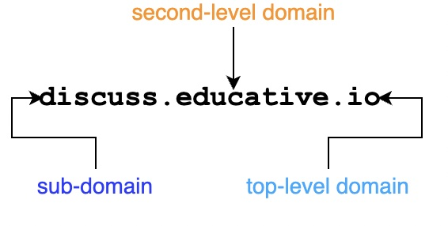

# DNS(Domain Name System)

client-server application layer protocol

[当前根域名服务器分布](https://root-servers.org/)

[顶级域名管理](https://www.icann.org/)

## How Do We Find Things on The Internet

1. IP addresses
2. domain names
3. CAS (Content Addressable Storage) alias FCS(Fixed Content Storage)
    * 两者都旨在存储在固定时间段内不会更改的数据

## 域名层级

## 域名服务分层

## 顶级域名
* com: This TLD was initially meant for commercial organizations only - but it has now been opened for general use.
* Example: codinginterview.com
* edu: Used by educational institutions.
* Example: stanford.edu
* gov: Only used by the U.S. government.
* Example: nasa.gov
* mil: Used by U.S. military organizations.
* Example: army.mil
* net: It was initially intended for use by organizations working in network technology such as ISPs, but it is now a general purpose domain like com.
* Example: doubleclick.net
* org: This domain was intended for non-profit organizations but has been opened for general use now.
* mozilla.org
* pk, uk, us,…: Country suffixes. 244 two-letter ones exist.
* Some new and uncommon suffixes include: name, mobi, biz, pro.
* International domains: 中國

## 本地 DNS 服务
ISP(internet service provider)

local resolver library

DHCP 设置 local DNS server

## 如何寻址

## 命令行工具
host is a DNS lookup utility.
## Resource Records
The DNS distributed database consists of entities called RRs, or Resource Records.
### Address(包含 IPv4 到主机名的映射)
educative.io. 299 IN A 104.20.7.183
* educative.io is the name
* 299 is the TTL(Time-to-live) in seconds(客户端缓存的时间)
* IN(互联网) is the class
* A is the type of the RR
* 104.20.7.183 is the RDATA.

### Canonical name(别名主机名与实际主机名的记录)
bar.example.com. CNAME foo.example.com.
* bar.example.com. alias name
* foo.example.com. Canonical name(规范主机名)

### Mail Exchanger(记录域名接受电子邮件的服务器)
educative.io IN MX 10 aspmx2.googlemail.com
* aspmx2.googlemail.com. 与主机关联的邮件服务器的名称

## DNS 消息

