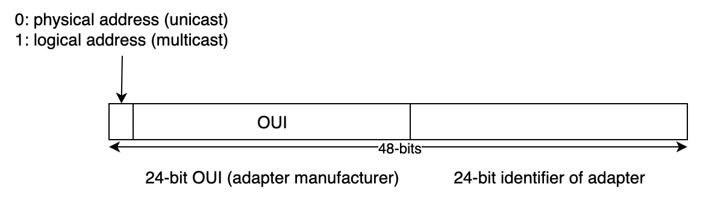
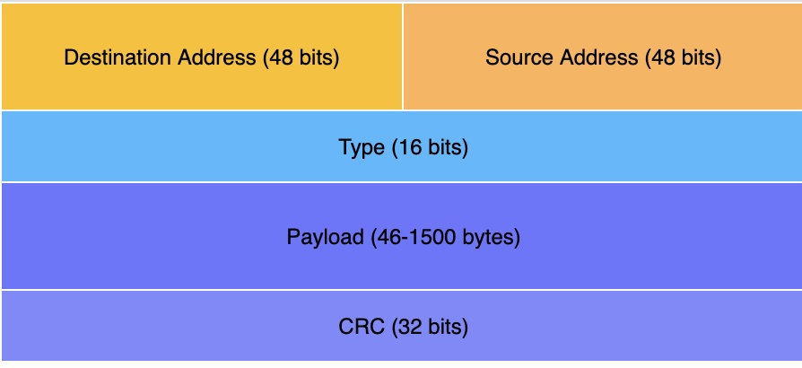
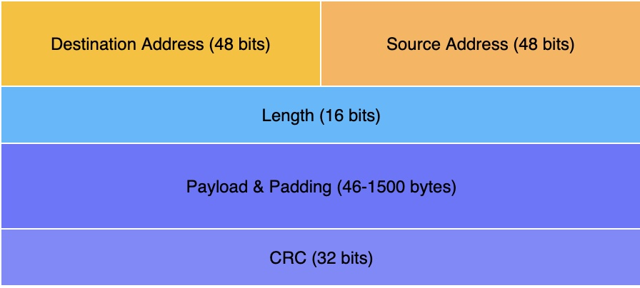
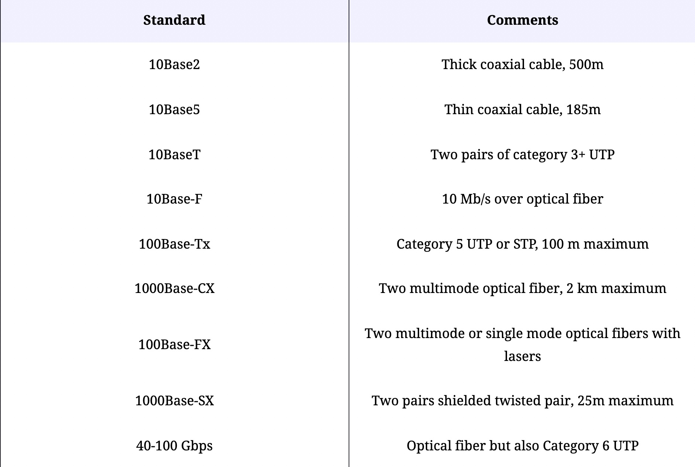
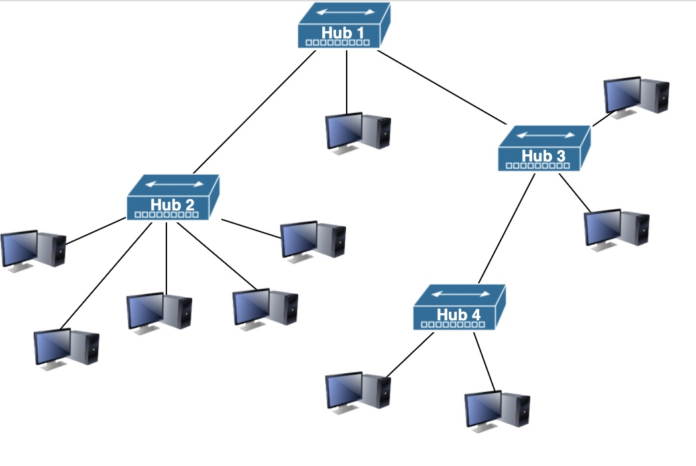
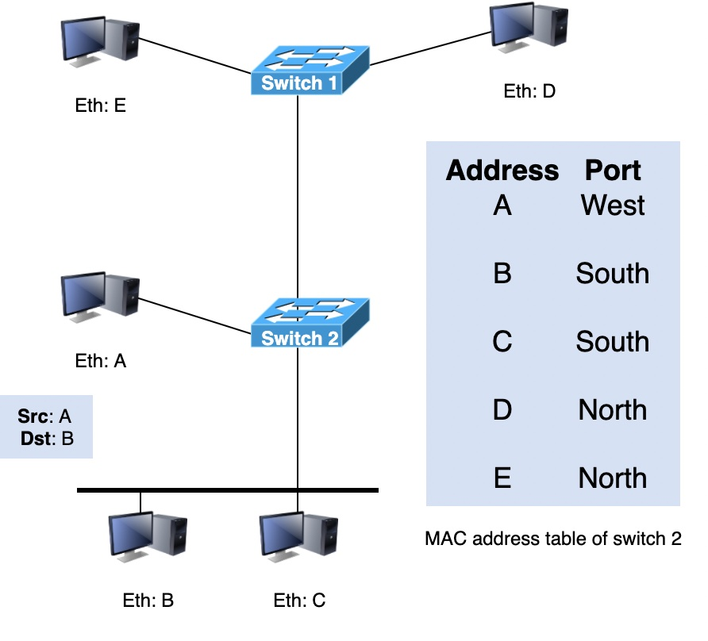

# 以太网
## MAC 地址

## 以太网帧

问题：
could not transparently transport short frames containing only a few bytes of payload

* EtherType values include:

    0x0800 for IPv4
    
    0x86DD for IPv6
    
    0x806 for the Address Resolution Protocol (ARP)
* 位循环冗余校验 (CRC)。 与 IP、UDP 和 TCP 使用的 Internet 校验和相比，此 CRC 能够捕获更多的传输错误。

为了解决这个问题，IEEE 决定将 Type 字段替换为长度字段。 此长度字段包含帧有效载荷中有用的字节数。 有效载荷仍必须至少包含 46 个字节，但填充字节由发送方添加并由接收方删除。

然而，如果没有类型字段，接收主机就不可能识别接收到的帧内的网络层数据包的类型。 为了解决这个新问题，IEEE 开发了一个全新的子层，称为逻辑链路控制。 在这个子层中定义了几个协议。 其中之一提供了与原始以太网帧格式的 Type 字段略有不同的版本。 另一个包含确认和重传以提供可靠的服务。

## 以太网标准

[Ethernet_physical_layer](https://en.wikipedia.org/wiki/Ethernet_physical_layer)

## 以太网集线器(Ethernet hub)
它将传入信号从一个传入接口转发到除信号传入的接口之外的所有其他接口。

首先，网络拓扑必须是一棵树。 由于集线器是物理层中的中继，在下面的网络中添加集线器 2 和集线器 3 之间的链接将创建一条电气捷径，从而完全破坏网络。 这意味着在基于集线器的网络中不能有任何冗余。 集线器或两个集线器之间的链路出现故障会将网络划分为两个隔离的网络。

其次，由于集线器是物理层中的中继，因此可能会发生冲突，并且必须像在 10Base5 网络中一样由 CSMA/CD 处理。 这意味着网络中任何一对设备之间的最大延迟不能超过 51.2 微秒，即时隙。 如果延迟较长，则可能无法正确检测短帧之间的冲突。 此约束限制了包含集线器的 10BaseT 网络的地理分布。

## 以太网交换机(Ethernet switch)
运行在数据链路层，并且可以分析每个帧的目的地地址并在通向目的地的链路上有选择地转发帧。 这将允许两个主机在一对接口上进行通信，而其他对接口可以同时用于其他通信，从而提高通信效率。

如果 MAC 地址表中有帧目标地址的条目，则在此条目中列出的端口上有选择地转发该帧。 否则，交换机不知道如何到达目标地址，它必须在其所有端口上转发该帧，除了已接收到该帧的端口。 这称为泛洪，它以一些不必要的传输为代价确保帧到达目的地。 这些不必要的传输只会持续到目的地发送了它的第一帧。

### mac 地址学习算法

1. 该算法提取接收帧的源地址，并记住从每个源以太网地址接收帧的端口。
2. 该信息被插入到交换机用来转发帧的 MAC 地址表中。
3. 这允许交换机自动学习可用于到达每个目标地址的端口，前提是该主机之前至少发送了一个帧。

### Spanning Tree Protocol
生成树协议使交换机能够交换控制消息，通过在拓扑中首先选出根交换机。 然后，所有交换机都指定其到达根交换机的具有最少跳数的端口之一作为生成树的一部分。 就帧转发而言，通向根交换机并因此创建环路的所有其他端口都被禁用。 最终，帧仅在作为生成树一部分的端口上转发。 不属于生成树的端口继续发送和接收控制帧。 这有助于从交换机或链路故障中恢复。