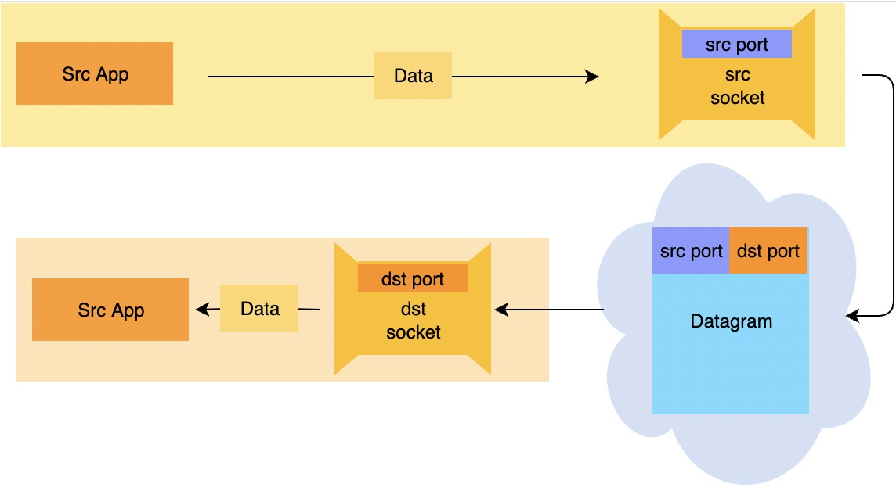

# 进程间通信

## Sockets

进程与计算机网络之间的接口称为 Socket,他是应用程序和网络之间的网关 。 请注意，Socket 与硬件无关——它们是软件接口。

进程只是将它们的消息定向到套接字。

## 寻址

### port
[rfc1700](https://tools.ietf.org/pdf/rfc1700.pdf)

* HTTP(80)
* HTTPS(443)
* SSH(22)
* DHCP(68、67)
* FTP(20、21)

客户端在一个众所周知的端口上与服务器建立初始连接，其余的通信通过连接到服务器上的临时端口来执行。