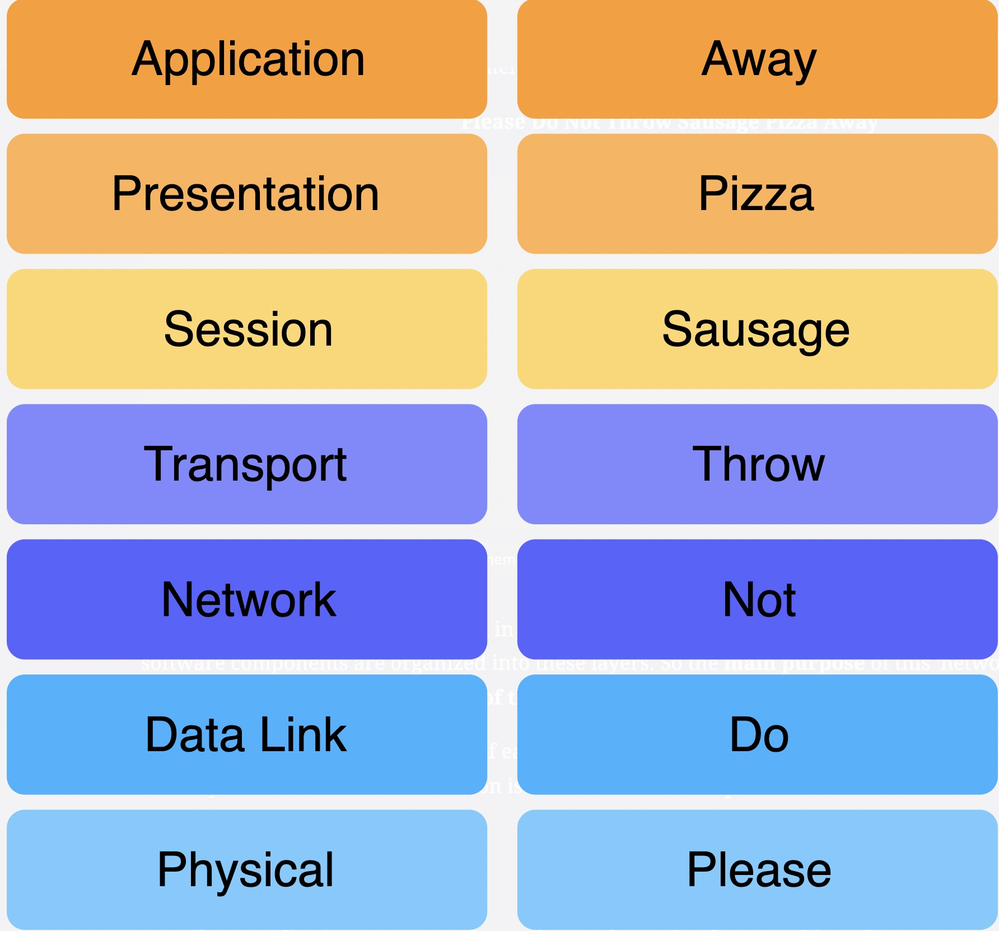
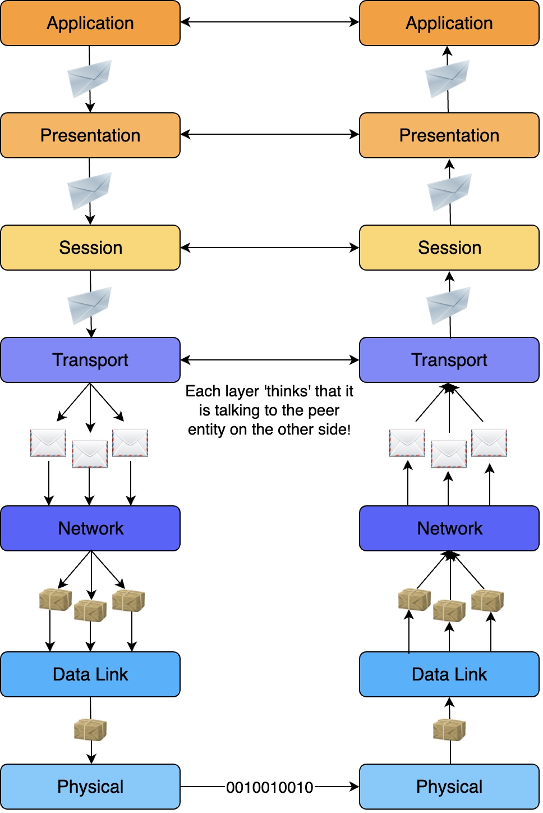

# OSI Model

## 应用层

1. 基本都是由软件实现
2. 用户和应用层交互
3. 大多数应用程序所在的地方
4. 传出消息的地方

## 表现层

1. 以应用层易于理解和显示的方式呈现数据
2. 加密
3. 端到端压缩
4. 假设用户会话被底层维护

## 会话层

1. 获取传输层的服务并在其上构建管理用户会话的服务，管理传输层传递的消息到会话的映射
2. 会话是本地应用程序和其他端系统上的远程服务之间的信息交换
3. 假定连接建立已经建立、数据包传输由其下层处理

## 传输层
1. 将上层传递的数据块分成更小的 datagrams 或 segments
2. 附加信息保证传输可靠

## 网络层
1. 网络层消息称为数据包
2. 路由选择(Routing protocols)
3. 负载平衡：在给定的网络中有许多链路（铜线、光纤、无线），网络层的一个目标是使它们大致平均地被利用。

## 数据链路层
1. 封装数据包以在单个链路上传输
2. 解决传输冲突
3. 处理寻址
4. Multiplexing & Demultiplexing

## 物理层
1. Provides a solid electrical and mechanical medium to transmit the data
2. 传输比特
## 数据传输过程

