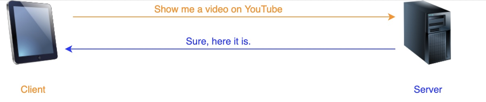
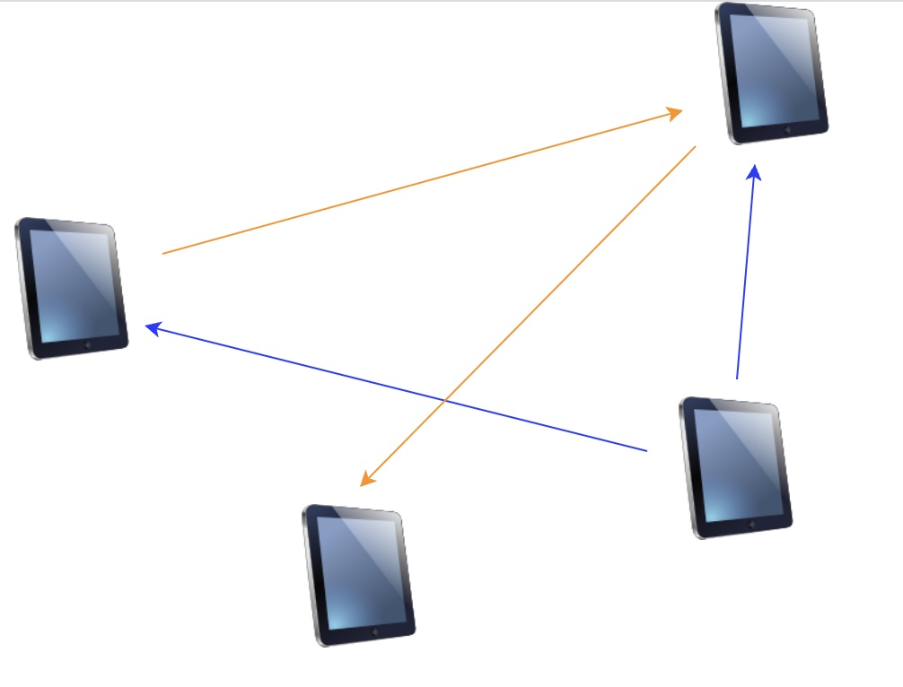

# 应用层架构

## Client-Server Architecture

### 服务器作用
1. 控制对集中资源或服务（例如网站）的访问
2. 可访问性很重要
3. 至少有一个可到达的 ip 地址
4. 服务器等待客户端请求
5. 服务器为了保证可用性一般会有多个服务器，容纳多个服务器的建筑被称为数据中心

### 客户端
1. 客户端发起连接

## Peer-to-Peer Architecture

在这种架构中，称为“对等点”的终端系统上的应用程序相互通信。 不涉及专用服务器或大型数据中心。 对等点大多位于家庭、办公室和大学中的笔记本电脑和台式机等 PC 上。

P2P 架构的主要优势在于它可以快速扩展——无需花费大量金钱、时间或精力。

无论 P2P 的去中心化性质如何，每个对等点都可以归类为服务器或客户端，即每台机器既可以作为客户端也可以作为服务器。 严格来说，发起连接的peer是client，另一个叫server。

### 例子
当今许多流行的应用程序，如 BitTorrent，都是基于 P2P 架构的。

当通过 BitTorrent 下载文件时，下载方会访问其他几个用户计算机上的文件位，并将它们放在一起。 这种情况下不涉及传统的“服务器”。

注意：P2P 与文件共享不同！ 一些早期的 P2P 应用程序用于文件共享。 例如，Napster 和 Gnutella。 由于这些 P2P 应用程序的巨大影响，很多人只将文件共享与 P2P 联系起来。

文件共享是一个特定的应用程序。 而 P2P 是分布式系统和应用程序架构的设计原则。

此外，文件共享并不是 P2P 的唯一应用。 其他示例包括：streaming media, telephony, content distribution, routing, and volunteer computing。

## Hybrid

混合架构在某种程度上涉及服务器的参与。 它本质上是 P2P 和客户端-服务器架构的组合。

