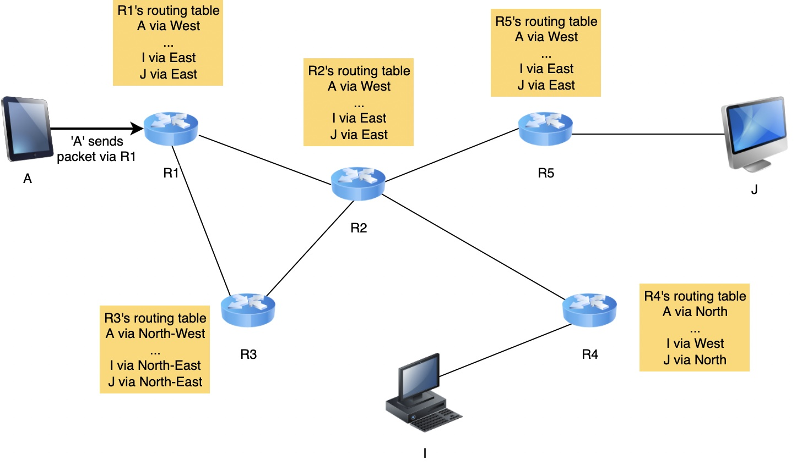
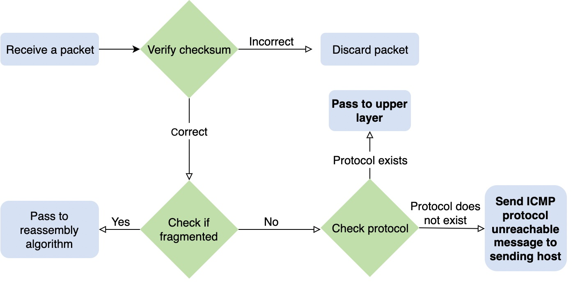

# 网络层

## 职责和目标
1. 使终端系统通过中间的路由进行信息(packet)交换

## 原则
1. 每个网络层实体由网络层地址标识
2. 网络层提供的服务不依赖于底层数据链路层的内部组织和服务
3. 网络层在概念上分为两个平面：

    数据平面。数据平面包含允许主机和路由器交换携带用户数据的数据包的协议和机制。
    控制平面。控制平面包含使路由器能够有效学习如何将数据包转发到最终目的地的协议和机制。

## 数据链路层的限制
1. 每种数据链路层技术都有不同的最大帧限制
2. 每个终端系统在数据链路层的每个接口有自己的链路层地址

## 网络层的组织

### 数据报(datagram)

#### 知识点
* IPv4 and IPv6 in the global Internet
* [CLNP](https://en.wikipedia.org/wiki/Connectionless-mode_Network_Service) defined by the ISO
* [IPX](https://en.wikipedia.org/wiki/Internetwork_Packet_Exchange) defined by Novell or [XNS](https://en.wikipedia.org/wiki/Xerox_Network_Systems) defined by Xerox.

#### 路由转发表
1. 允许网络中的任何主机访问任何其他主机。 这意味着每个路由器都必须知道通往每个目的地的路由。

2. 由存储在转发表中的信息组成的路径不得包含环路。 否则，某些目的地将无法到达。

路由表通常用于生成转发表的信息，转发表是路由表的一个子集。 因此，一个路由表可能有 3 条路径用于一个源，目标对是由几种不同的算法生成的，这些算法也可能是手动输入的。 然而，转发表将只有那些条目中的一个，通常是基于另一种算法或标准的首选条目。 转发表通常针对存储和查找进行优化

### 虚拟电路(virtual circuits)
双向通道
#### 知识点
* [X.25](https://en.wikipedia.org/wiki/X.25)
* [Frame Relay](https://en.wikipedia.org/wiki/Frame_Relay)
* [Asynchronous Transfer Mode (ATM) network](https://en.wikipedia.org/wiki/Asynchronous_Transfer_Mode).

## 接收包过程

[ICMP](https://zh.wikipedia.org/wiki/%E4%BA%92%E8%81%94%E7%BD%91%E6%8E%A7%E5%88%B6%E6%B6%88%E6%81%AF%E5%8D%8F%E8%AE%AE)

