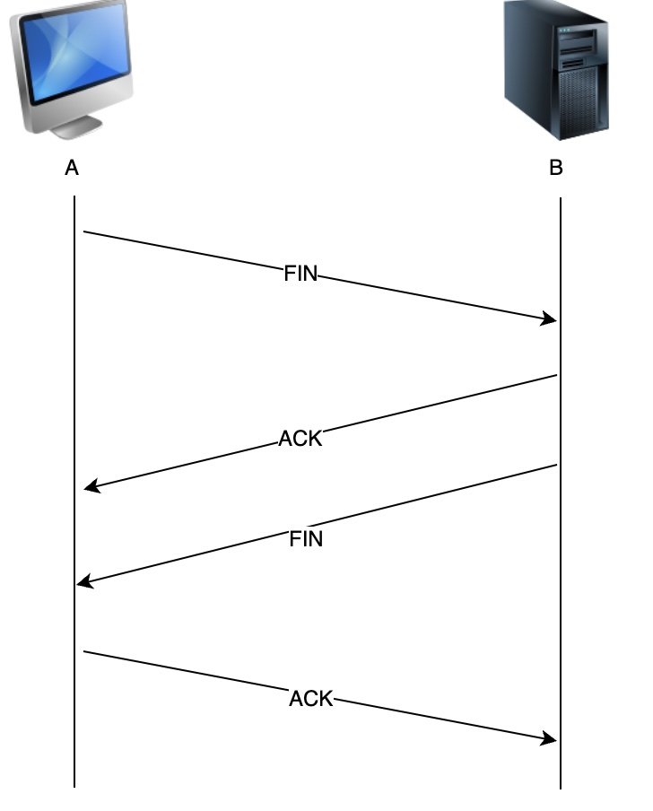

# 传输层

## 职责
1. 传输层将消息从网络传送给应用程序
2. 解决网络层的瑕疵
    * 传输错误可能会损坏 Segments(校验和)
    * Segments 可能丢失 (重传定时器)
    * Segments 顺序不一致或 重复传输(sequence number)

## 功能
### Multiplexing and Demultiplexing

### 校验和

#### 校验和计算
发送端

接收端

对消息 求和，并于发过来的校验和进行相加，如果结果是 1111111111111111，则消息正确。

### 重传定时器

## UDP(connectionless)

[rfc768](https://tools.ietf.org/pdf/rfc768.pdf)

Length of the datagram (header and data in bytes)

UDP一次交付一整个报文

### 基于 UDP 的协议
1. [Network Management](https://en.wikipedia.org/wiki/Simple_Network_Management_Protocol)
2. DNS
3. Xbox
4. Quick UDP Internet Connections (QUIC)

## TCP(connection-oriented)

1. ECN CWR 这些标志，拥塞窗口减少和显式拥塞通知用于处理拥塞。 简单来说，ECN 标志是由接收方设置的，这样发送方就知道发生了拥塞。 发送方设置 CWR 标志以响应此消息，以便接收方知道发送方已减小其拥塞窗口以补偿拥塞，并且发送方正在以较慢的速率发送数据。
3. URG 紧急标志将消息中的某些数据标记为紧急。 收到紧急段后，接收主机将紧急数据转发给应用程序，并指示发送方将数据标记为紧急。 段中的其余数据正常处理。

    当假设正在传输一个大文件但发送方意识到它是错误的文件并发送命令停止传输时，将使用此方法。 首先让文件完成传输是没有意义的，因此停止传输的命令被标记为紧急并在文件传输完成之前执行。
4. ACK 为 1 以确认先前接收到的 segment
5. Push 如果接收到多个小的 TCP 段，接收方 TCP 会将它们组合起来，然后再将它们交给应用层。 但是，当设置了 Push (PSH) 标志时，接收端会立即将数据从其缓冲区刷新到应用程序，而不是等待其余数据到达。

    这通常用于 Telnet 等应用程序，其中每个按键都是一个命令。 说缓冲 50 次击键并将它们一次发送到应用层是没有意义的，因此，每次击键都会被按下。
6. RST 为 1 终止连接
7. SYN 用于初始化连接
8. FIN 用于终止或完成与主机的连接

### 特点
1. 全双工
2. 点对点(无法进行广播和多播)
3. 纠错功能
4. 流控制
5. 拥塞控制
### 基于 TCP 的协议
1. File Transfer Protocol
2. Secure Shell
3. SMTP, IMAP, and POP
4. HTTP and HTTPS
