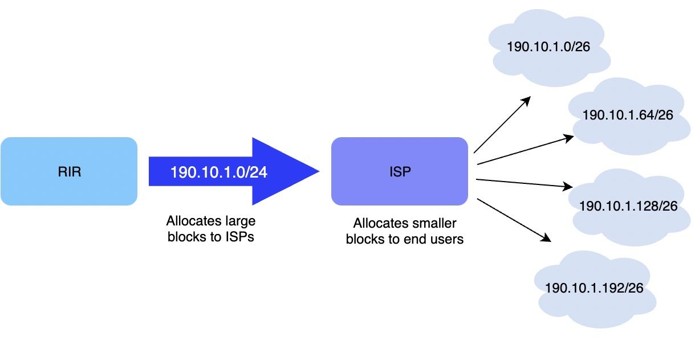
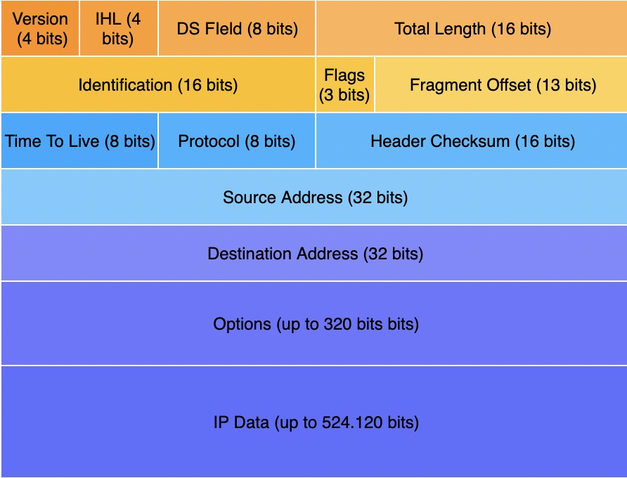
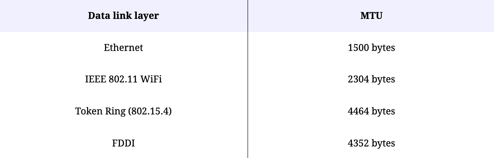
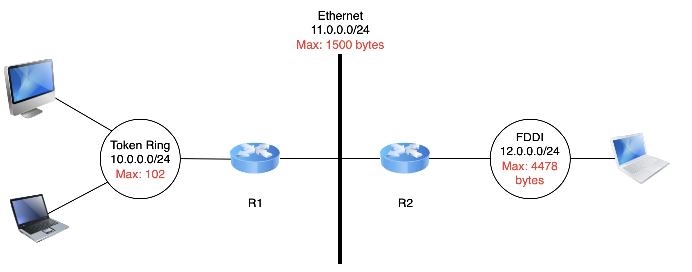
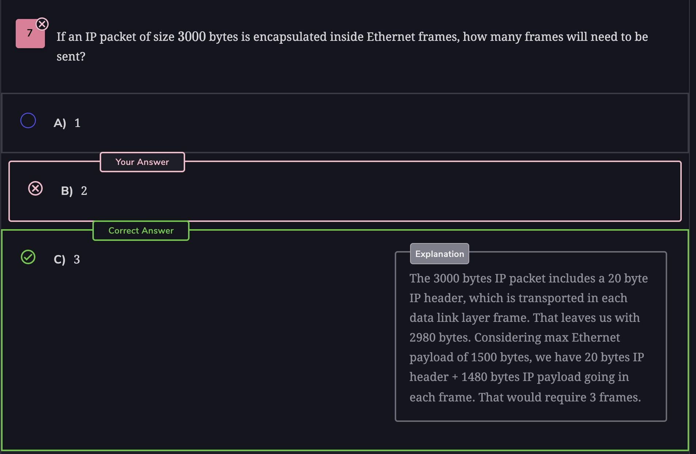

# ipv4
[rfc791](https://datatracker.ietf.org/doc/html/rfc791.html)
## 地址分类
[rfc791](https://datatracker.ietf.org/doc/html/rfc791.html)
* Class A: `0.0.0.0` to `127.255.255.255`
* Class B: `128.0.0.0` to `191.255.255.255`
* Class C: `192.0.0.0` to `223.255.255.255`
* Class D: `224.0.0.0` to `239.255.255.255`
* Class E: `240.0.0.0` to `255.255.255.255`

## 网络地址
host bits are all set to 0

just used for forwarding table entries
## 广播地址
host bits are all set to 1

用于向网络上的所有设备广播数据包

## 默认子网掩码(Default Subnet Masks)
network ID portion has all 1 and the host ID portion has all 0

## 变长子网掩码(Variable-Length Subnets)
[rfc1519](https://datatracker.ietf.org/doc/html/rfc1519)

A.B.C.D/p

A.B.C.D: concatenating the subnet identifier with a host identifier containing only 0
p: length of the subnet identifier in bits

`10.0.0.0/30`

## 无类域间路由(Classless Interdomain Routing)

### 谁分配地址块
区域 IP 注册管理机构 (RIR): 全称 Regional IP Registries 

### 如何寻址

longest prefix match or the more specific match.

## 特殊的 IP 地址
[rfc5735](https://datatracker.ietf.org/doc/html/rfc5735#section-4)

[保留的 IP 地址](https://zh.wikipedia.org/wiki/%E4%BF%9D%E7%95%99IP%E5%9C%B0%E5%9D%80)
* 0.0.0.0/8：保留用于自我识别。这个块中的一个常见地址是 0.0.0.0，我们在上一章中看到使用过！

* 127.0.0.0/8，为环回地址保留。每个 IPV4 主机都有一个环回接口（未连接到数据链路层）。按照惯例，IPv4 地址 127.0.0.1 被分配给这个接口，正如我们在前一章中看到的。这允许在主机上运行的进程使用 TCP/IP 来联系在同一主机上运行的其他进程。这对于测试目的非常有用。此外，环回接口不能关闭。如果设备已启动，则其环回接口也已启动。是的，复数也是故意的。您可以根据需要配置任意数量的环回接口。在这种情况下，可以为环回接口分配不同的 IP 地址。无论如何，在配置某些路由协议时，环回接口地址用作路由器标识符。我们希望即使某些物理接口出现故障，路由进程也能继续运行。环回接口提供所需的稳定性。

* 10.0.0.0/8、172.16.0.0/12 和 192.168.0.0/16 保留用于不直接连接到 Internet 的专用网络。这些地址通常称为私有地址。

* 169.254.0.0/16 用于链路本地地址。当某些主机连接到未按预期分配地址的网络时，它们会使用此块中的地址。

## ipv4 头
[rfc791](https://datatracker.ietf.org/doc/html/rfc791.html#section-3.1)

* version: 构建头的IP 的版本
* IP Header Length (IHL): length of the IP header in 32-bit words.
* DS: this field that is used for Quality of Service.
    当路由转发目标的数据包大于 MTU， 如果发送了 DF 标志，则发送需要分段的 ICMP 消息，或者如果未设置 DF，则数据包被分段。
* total length: indicates the total length of the entire IPv4 packet (header and payload) in bytes.
* Identification: 标识.
* Flags. 
    * Don’t Fragment: 表示后续有更多分片
    * More Fragments: 表示不能再进行分片
    * Reserved (must be zero)
* Fragment Offset: 帧偏移, 8 byte as 1.
* Time To Live: This number is decremented at each hop. When it becomes 0, the packet is considered to have been in the network for too long and is dropped.
* Protocol: indicates the transport layer protocol that must process the packet’s payload at the destination. Common values for this field are 6 for TCP and 17 for UDP.
* checksum: only the IPv4 header against transmission errors.
* source address:
* destination address:
* Options this field is not used very often. It’s often used to test out experimental features.
* IP Data: They payload. This payload is not part of the checksum.

##  数据链路层的异质性
A second problem for IPv4 is the heterogeneity of the data link layer. IPv4 is used above many very different data link layers. Each of which has its own characteristics. For example, each data link layer is characterized by a maximum frame size or **Maximum Transmission Unit (MTU)**. The MTU of an interface is the largest IPv4 packet (including header) that it can send. The table below provides some common MTU sizes.

### 为什么网络层要支持分片

