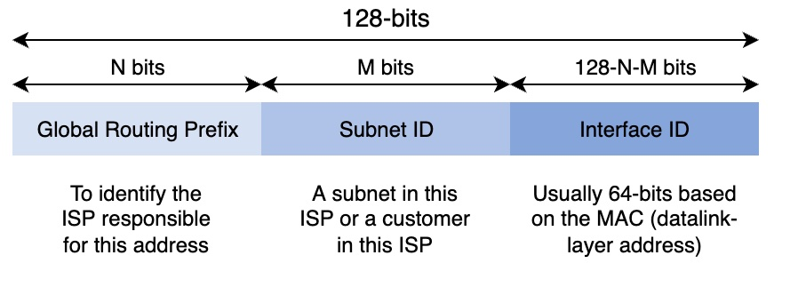
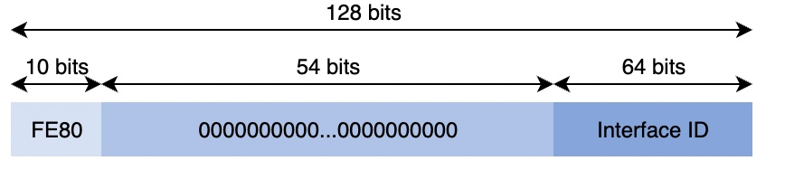
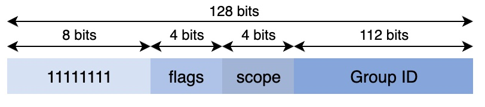

# ipv6
[rfc3513](https://datatracker.ietf.org/doc/html/rfc3513)

## Unicast

an IPv6 unicast address is used to identify one data link layer interface on a host

[分配情况](https://www.iana.org/assignments/ipv6-address-space/ipv6-address-space.xhtml)

### Provider Independent Addresses

provider-independent (PI) addresses:
分配给连接到至少两个不同 ISP 的 Internet 服务提供商和大公司。使得大公司拥有地址块的使用权。

provider-aggregatable (PA) address:
Internet 服务提供商将提供商聚合 (PA) 地址块从他们自己的 PI 地址块分配给他们的客户。

### 用途
* /32 for an Internet Service Provider
* /48 for a single company
* /64 for a single user (e.g. a home user connected via ADSL)
* /128 in the rare case when it is known that no more than one end host will be attached.

### Unique Local Unicast Addresses
* [rfc4193](https://datatracker.ietf.org/doc/html/rfc4193#section-3.1) ->
[rfc1918](https://datatracker.ietf.org/doc/html/rfc1918.html#section-3)
* FC00::/7 -> private IPv4 addresses
* ::1 -> 127.0.0.1 
* :: -> 0.0.0.0

### Link-Local Unicast Addresses
[rfc4291](https://datatracker.ietf.org/doc/html/rfc4291.html#section-2.5.6)-ipv6

[rfc3927](https://datatracker.ietf.org/doc/html/rfc3927.html)-ipv4

* Each host can compute its own link-local address by concatenating the FE80::/64 prefix with the 64 bits identifier of its interface.
* Link-local addresses can be used when hosts that are attached to the same link (or local area network) need to exchange packets.
* They are used notably for address discovery and auto-configuration purposes.
* Their usage is restricted to each link, and a router cannot forward a packet whose source or destination address is a link-local address.
* Link-local addresses have also been defined for IPv4 RFC 3927. However, the IPv4 link-local addresses are only used when a host cannot obtain a regular IPv4 address, e.g., on an isolated LAN.

## Anycast
[rfc4291](https://datatracker.ietf.org/doc/html/rfc4291.html#section-2.6.1)

主机使用它来快速向其子网内的任何路由器发送数据包
## Multicast
[rfc4291](https://datatracker.ietf.org/doc/html/rfc4291.html#section-2.7)

* all end-system automatically belong to the FF02::1 multicast group
* all routers automatically belong to the FF02::2 multicast group