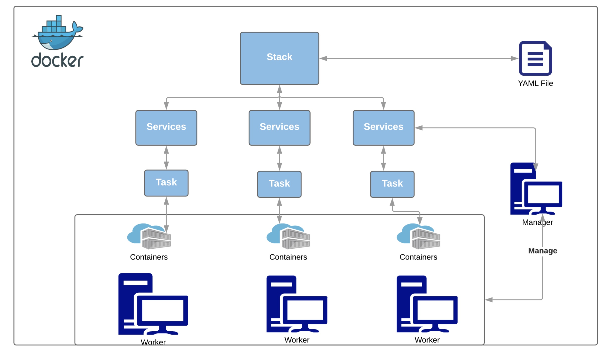
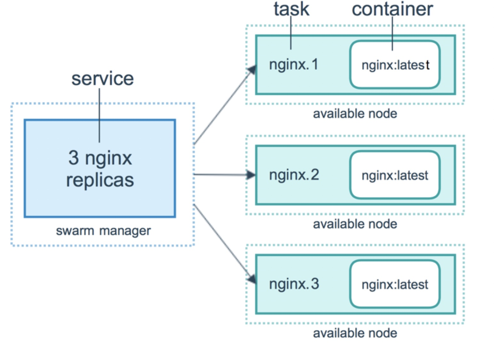
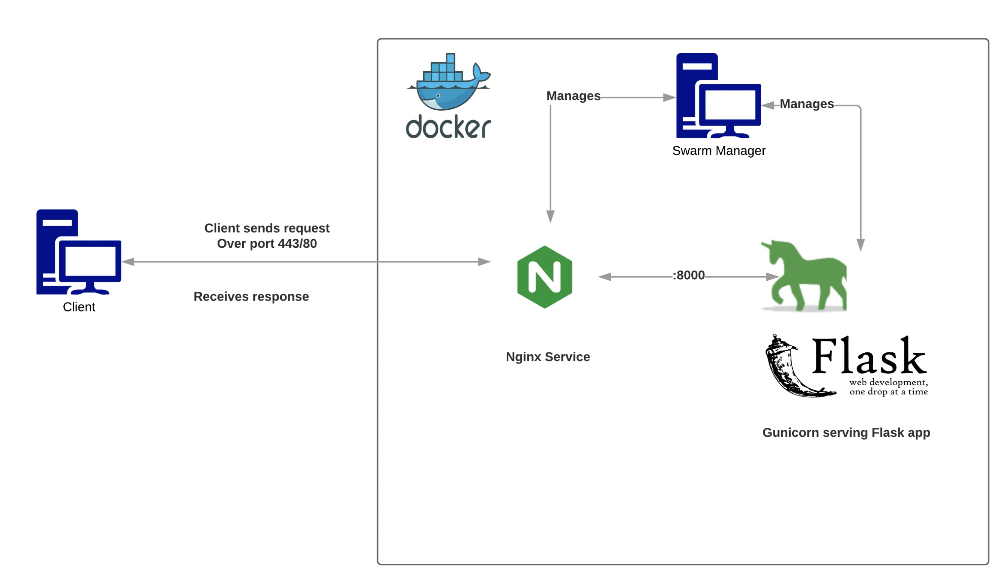

```
docker service create --name database --env-file .env --mount type=bind,src=/Users/venkateshachintalwar/Documents/Online_Projects/Docker/db/init.sql,dst=/docker-entrypoint-initdb.d/init.sql mysql/mysql-server:5.7
```

```
git clone https://github.com/venky8283/Docker.git
```